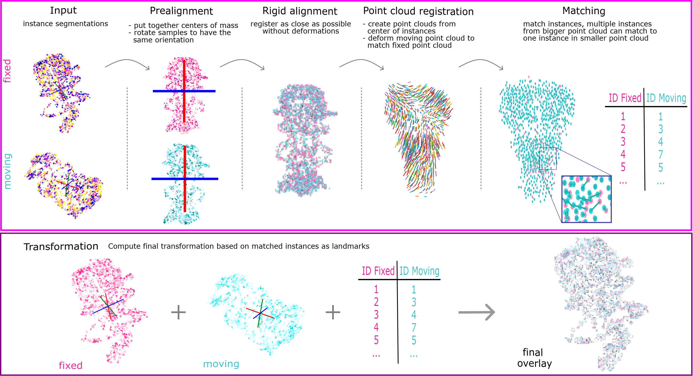

# 💞 Image-Matchmaker
Tool for segmentation-based deformable registration and object matching

## Overview

Image-Matchmaker is a framework that leverages **instance segmentation masks** to align two volumetric
datasets of e.g. different modalities like EM and LM. It optimizes a transformation that maps a
**moving** volume onto a **fixed** reference volume, progressively refining the spatial
correspondence through a sequential pipeline:

1. **Pre-alignment (SVD)** — coarse global alignment of centroids and principal axes.
2. **Rigid registration (Elastix)** — rotation + translation refinement.
3. **Coherent Point Drift (CPD)** — non-rigid alignment of instance-centroid point clouds.
4. **Instance matching** — establish instance correspondences.
5. **B-spline registration (Elastix)** — final deformable alignment driven by the matched
   landmarks on the original masks (rigid → rough → fine B-spline).

The composed rigid + B-spline transform can then be reapplied to the raw channels of the
original volumes (e.g. raw EM or fluorescence LM) to bring them into a shared coordinate space.

## Documentation

Full documentation is available at **https://image-matchmaker.readthedocs.io/**, including:

- [Installation](https://image-matchmaker.readthedocs.io/en/latest/installation.html) — set up the conda environment.
- [Quickstart](https://image-matchmaker.readthedocs.io/en/latest/quickstart.html) — run your first registration.
- [Usage](https://image-matchmaker.readthedocs.io/en/latest/usage.html) — Snakemake workflow, command-line scripts, and Python API.
- [Configuration reference](https://image-matchmaker.readthedocs.io/en/latest/config_ref.html) — registration and transform parameters.
- [Outputs](https://image-matchmaker.readthedocs.io/en/latest/outputs.html) — files produced by each stage.
- [Troubleshooting](https://image-matchmaker.readthedocs.io/en/latest/troubleshooting.html) — common issues and solutions.
